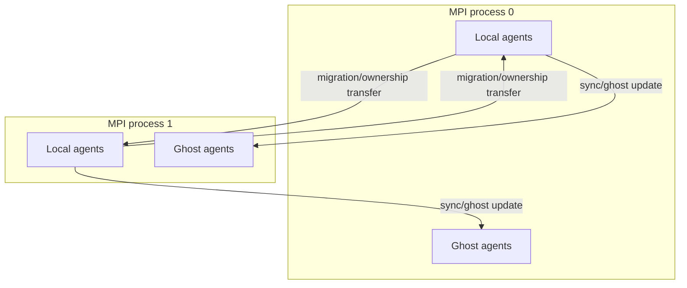
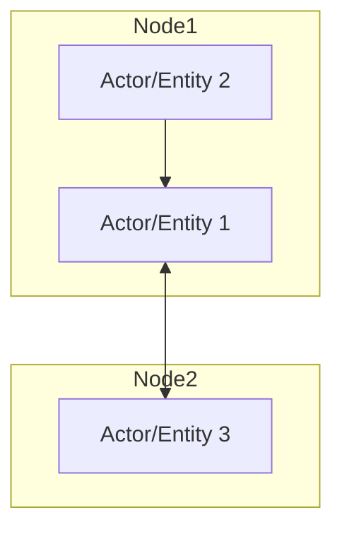
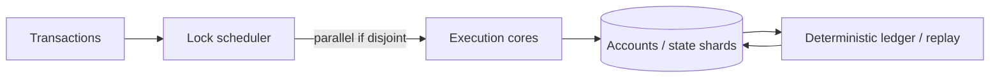
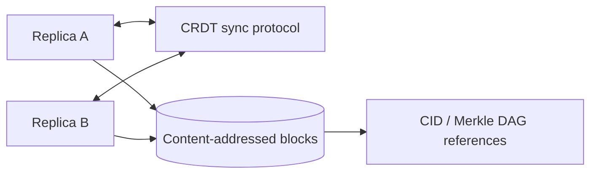
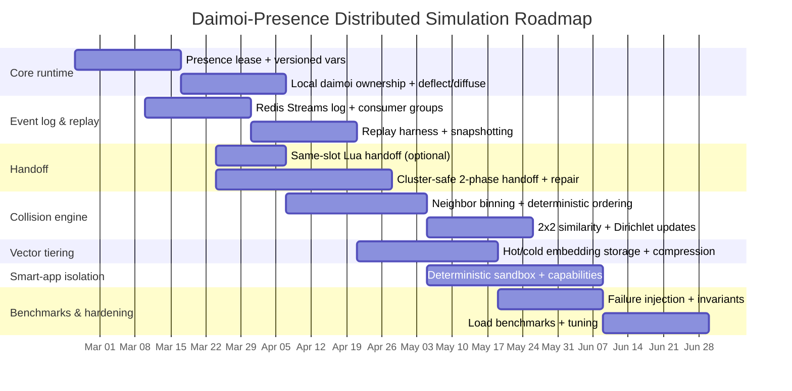
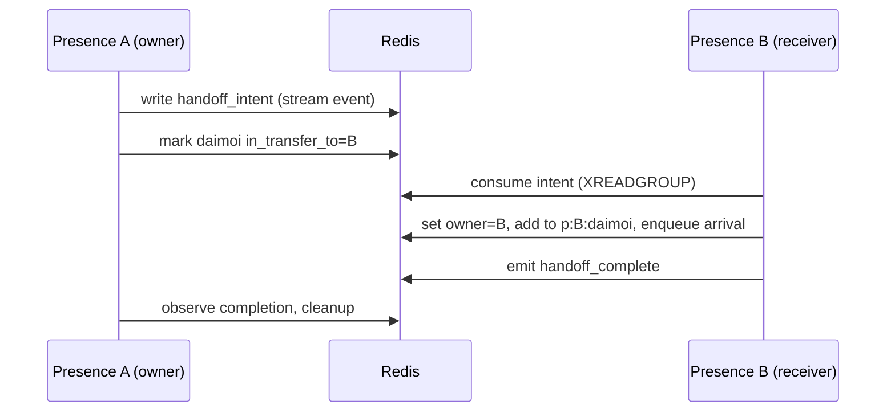

# Distributed Probabilistic ECS Analogues for Daimoi–Presence Simulations

## Executive summary

This report surveys real-world systems that are structurally analogous to your **distributed probabilistic Entity–Component System**: mobile particles/agents that carry high-dimensional state (your embeddings), probabilistic payloads (your Dirichlet/Beta parameters), collide/merge/transfer state, and move across **single-writer namespaces** (“Presences”) with shared read access over a **Redis-like** datastore. The closest “family resemblances” appear in four mature ecosystems:

High-performance particle engines (molecular dynamics) such as LAMMPS and HOOMD-blue provide a proven blueprint for **single-writer ownership + handoff** via **spatial domain decomposition**, “ghost” replicas for neighbor interactions, and explicit migration of particles between owning partitions. citeturn0search12turn18search2turn0search8turn11search3

Distributed agent-based simulations such as Repast HPC and Repast4Py offer a blueprint for **distributed entities + ghosting + synchronization** in MPI settings, including an explicit notion of “local agents” (owned) versus remote representations. citeturn18search18turn18search0turn18search1

Actor and stateful-service runtimes (e.g., Microsoft Orleans, Akka, Dapr Actors) embody **single-threaded, turn-based state ownership** at the granularity of an actor/entity (“Presence-like”) and use message passing + persistence patterns to avoid multi-writer races. citeturn0search2turn19search4turn4search0turn12search5

“Smart-contract-like” concurrency models (notably Solana’s account locking and Sealevel runtime) demonstrate a robust general pattern: declare read/write sets upfront; execute non-conflicting transactions in parallel; serialize writes to the same state to preserve determinism. This is extremely close to “each presence owns one var-set but anyone can read.” citeturn10search6turn10search0turn10search10

On the storage and coordination layer, Redis Streams + consumer groups and Redis Lua/transactions provide practical building blocks for **shared read, single-writer commits, atomic handoff, at-least-once processing, and replayable logs**—but you must explicitly respect clustering constraints (same hash slot for multi-key atomicity). citeturn19search2turn17search0turn9search1turn21search3turn21search0

The main gaps relative to your Daimoi model are: (1) **vector payload storage and update bandwidth** (embeddings are large and collision-heavy), (2) **atomic multi-key handoff** across shards/clusters, (3) **deterministic replay** under failures/at-least-once delivery, and (4) **security/isolation** of “smart-app Presence” code. These can be addressed by combining: Solana-style read/write scheduling, event-sourcing logs for replay, Redis slot-co-location design, Lua/CAS patterns, vector compression/quantization and batching, and a sandboxed execution model inspired by systems like SpacetimeDB reducers and Redis Lua sandboxing. citeturn10search6turn21search3turn19search1turn19search9turn9search20

## Real-world analogous systems in academia and industry

Below are concrete “reference exemplars.” Each includes: purpose, a mermaid architecture diagram, data model sketch, concurrency/ownership model, handoff/state-sharing mechanism, and primary-source links.

### HPC particle engines with domain decomposition and particle migration

**Representative systems**: LAMMPS (MPI domain decomposition); HOOMD-blue (multi-GPU MPI domain decomposition). citeturn0search12turn11search3

**Purpose**  
Simulate large particle systems by dividing space into subdomains; each compute rank owns particles in its subdomain and exchanges boundary (“ghost”) data with neighbors. citeturn0search12turn18search2turn0search8turn11search3

**Architecture (mermaid)**  
```mermaid
flowchart LR
  subgraph RankA[MPI Rank A (owns subdomain A)]
    AOwned[Owned particles]
    AGhost[Ghost particles from neighbors]
  end
  subgraph RankB[MPI Rank B (owns subdomain B)]
    BOwned[Owned particles]
    BGhost[Ghost particles from neighbors]
  end

  AOwned -- forward comm: boundary attrs --> BGhost
  BOwned -- forward comm: boundary attrs --> AGhost

  AOwned -- migrate when crossing boundary --> BOwned
  BOwned -- migrate when crossing boundary --> AOwned
```

**Data model (sketch)**  
Particles are records with position/velocity plus per-particle attributes. LAMMPS explicitly distinguishes **owned atoms** and **ghost atoms** (copies used to compute forces across boundaries). citeturn18search2turn0search8

**Concurrency / ownership model**  
Single-writer per particle: each particle is owned by exactly one rank (subdomain). Ghost copies are read-mostly replicas updated through “forward communication.” citeturn18search2turn0search8

**State sharing and handoff**  
Handoff is explicit: when particles cross partition boundaries, they “migrate to new owning processors.” LAMMPS provides migration routines (“migrate_atoms”) that exchange per-atom data so the atom becomes owned by the new processor. citeturn18search2turn18search6

**Primary sources (links)**  
```text
https://docs.lammps.org/Developer_par_part.html
https://docs.lammps.org/Developer_par_comm.html
https://docs.lammps.org/Developer_par_neigh.html
https://docs.lammps.org/Developer_comm_ops.html
https://hoomd-blue.readthedocs.io/en/v2.9.7/mpi.html
```

**Why this matches Daimoi**  
A daimoi is essentially an “owned particle” with rich attributes; collisions are local-neighborhood interactions; and crossing a Presence boundary is exactly “particle migration to a new owning processor,” with ghosting as the analog of shared-read visibility near boundaries. citeturn18search2turn18search6turn0search8

---

### MPI-distributed agent-based simulations with local ownership and ghost agents

**Representative systems**: Repast HPC; Repast4Py (Python). citeturn18search18turn18search0

**Purpose**  
Run large-scale ABMs by distributing agents across processes in an environment “in which many processes are running in parallel and memory is not shared,” with each process responsible for its local agents. citeturn18search18turn18search0

**Architecture (mermaid)**  


**Data model (sketch)**  
Agents are distributed across processes; each process holds local agents and (depending on model) maintains representations needed to compute local interactions. Repast4Py explicitly targets “MPI-distributed ABMs.” citeturn18search18turn18search0turn18search1

**Concurrency / ownership model**  
Single-writer per agent: each agent is “local” to one process; other processes observe via synchronized representations (ghosts). citeturn18search18

**State sharing and handoff**  
The model’s core pattern is explicit synchronization: local state changes are propagated during sync phases. This is analogous to “Presences own vars; everyone reads” but with structured boundaries (only what is needed is shared). citeturn18search18turn18search0

**Primary sources (links)**  
```text
https://repast.github.io/docs/repast_hpc.pdf
https://pmc.ncbi.nlm.nih.gov/articles/PMC9912342/
https://repast.github.io/repast4py.site/guide/user_guide.html
https://repast.github.io/repast_hpc.html
```

**Why this matches Daimoi**  
Repast’s clean separation of “local agents” vs “ghost agents” is a strong existing analog for: local collision handling + shared-read observation without multi-writer updates. citeturn18search18turn18search0

---

### Virtual actor runtimes with single-threaded state and asynchronous messaging

**Representative system**: Microsoft Orleans (virtual actors / grains). citeturn0search2turn0search6

**Purpose**  
Provide a programming model for large distributed systems where each actor/grain encapsulates state and processes requests in a single-threaded manner, avoiding explicit locking in user code. The Orleans research report describes a single-thread guarantee: “at most one thread runs at a time within each activation,” so activation state is never concurrently accessed. citeturn0search2turn19search4

**Architecture (mermaid)**  
```mermaid
flowchart LR
  Client --> GW[Orleans runtime / gateway]
  GW --> SiloA[Silo A]
  GW --> SiloB[Silo B]

  subgraph SiloA
    GrainX[Grain X (state + behavior)]
  end

  subgraph SiloB
    GrainY[Grain Y (state + behavior)]
  end

  GrainX <--> GrainY
```

**Data model (sketch)**  
A grain activation encapsulates its state and exposes methods invoked by asynchronous messages/requests. Orleans documentation describes it as actor-model-based with “virtual actor abstraction.” citeturn0search6turn0search2

**Concurrency / ownership model**  
Single-writer per grain activation: by default, a grain processes each request to completion before beginning the next request, reflecting a single-threaded execution model. citeturn19search4

**State sharing and handoff**  
Orleans’ core approach is *not* shared-state reads; instead, state is accessed through message-based calls (queries/commands). However, your “read anything” requirement can be approximated via read-only grains or cached projections that are published to a shared store. The important transferable technique is strong single-writer state ownership at fine granularity. citeturn0search6turn19search4

**Primary sources (links)**  
```text
https://www.microsoft.com/en-us/research/wp-content/uploads/2016/02/Orleans-MSR-TR-2014-41.pdf
https://learn.microsoft.com/en-us/dotnet/orleans/overview
https://learn.microsoft.com/en-us/dotnet/orleans/grains/request-scheduling
```

**Why this matches Daimoi**  
A Presence can be modeled as a grain: one “turn” updates its vars and owned daimoi; concurrency safety is inherited from the runtime. citeturn19search4turn0search2

---

### Actor/event-sourced systems and “turn-based” concurrency

**Representative systems**: Akka typed actors; Dapr Actors (virtual actor building block); event-sourced entities patterns. citeturn4search0turn12search5turn3search6

**Purpose**  
Actors provide deferred execution and state encapsulation. Akka’s typed guide explicitly states actors “react to incoming messages sequentially, one at a time.” citeturn4search0  
Dapr Actors provides a turn-based access model, enforcing per-actor locks so only one thread is active inside an actor at a time (unless reentrancy is enabled). citeturn12search11turn12search5

**Architecture (mermaid)**  


**Data model (sketch)**  
Actor = (state, behavior, mailbox). Mailboxes buffer messages; processing is sequential per actor. citeturn4search0turn3search1

**Concurrency / ownership model**  
Single-threaded / turn-based per actor. Dapr describes enforcing the model via acquiring a per-actor lock at the beginning of a “turn” and releasing it at the end. citeturn12search5turn12search11

**State sharing and handoff**  
Actors typically do not expose raw shared reads. Instead, derived read models (CQRS projections) or external materializations provide shared read access. Event-sourced entities explicitly model state + events, and behavior is implemented in command/event handlers. citeturn3search6turn4search20

**Primary sources (links)**  
```text
https://doc.akka.io/libraries/akka-core/current/typed/guide/actors-intro.html
https://docs.dapr.io/developing-applications/building-blocks/actors/actors-overview/
https://docs.dapr.io/developing-applications/building-blocks/actors/actors-features-concepts/
https://doc.akka.io/sdk/event-sourced-entities.html
```

**Why this matches Daimoi**  
Your core need—**each Presence is the single writer for its var-space**—is the actor model’s “home turf.” The missing piece is “read anything,” which can be solved by externalizing immutable snapshots/projections. citeturn4search0turn12search5turn3search6

---

### Append-only log and event-sourcing infrastructures

**Representative systems**: Apache Kafka, Kafka Streams; EventStoreDB (Kurrent). citeturn20search3turn2search1turn15search0

**Purpose**  
Provide durable, replayable logs to reconstruct state and support exactly-once or at-least-once processing depending on configuration and semantics. Kafka documentation states that consumers of a topic-partition read events “in exactly the same order as they were written.” citeturn20search3  
EventStoreDB’s documentation supports optimistic concurrency by specifying expected stream revision/version on append. citeturn2search1turn19search7

**Architecture (mermaid)**  
```mermaid
flowchart LR
  Producers --> Topic[Kafka topic (partitioned log)]
  Topic --> Proc[Stream processor / consumers]
  Proc --> Projections[Materialized state / projections]
  Proc --> NewEvents[New events appended]

  subgraph ES[EventStoreDB]
    Stream[Per-entity stream]
  end
  Proc <--> Stream
```

**Data model (sketch)**  
Kafka: ordered events per partition; Kafka Streams introduces state stores and supports exactly-once processing semantics (EOS) when configured. citeturn15search0turn15search2  
EventStoreDB: per-stream event sequences; append operations optionally check expected revision/version. citeturn2search1turn19search7

**Concurrency / ownership model**  
Kafka ordering is per partition; multi-producer/multi-subscriber exists, but ordering is per partition and must be planned around keying. citeturn15search3turn20search3  
EventStoreDB uses optimistic concurrency via stream version checks. citeturn2search1turn19search7

**State sharing and handoff**  
Your system can treat collisions/handoffs as events in logs (Kafka or EventStoreDB). Then “Presence vars” become projections: fold events for a presence to reconstruct state at any point. citeturn3search21turn2search1turn20search3

**Primary sources (links)**  
```text
https://kafka.apache.org/documentation/
https://kafka.apache.org/42/design/design/
https://kafka.apache.org/37/configuration/kafka-streams-configs/
https://docs.kurrent.io/clients/node/legacy/v6.2/appending-events
https://www.kurrent.io/blog/exploring-the-main-features-of-eventstoredb-2/
```

**Why this matches Daimoi**  
Your “probabilities shift on collisions” is naturally captured as an append-only, replayable stream: immutable collision events + deterministic reducer = reproducible outcomes. citeturn3search21turn20search3turn2search1

---

### Redis-backed distributed apps: Streams, consumer groups, transactions, and atomic scripts

**Representative system**: Redis Streams + consumer groups + Lua/transactions patterns. citeturn19search2turn17search0turn9search1turn9search4

**Purpose**  
Offer a shared in-memory (optionally persistent) datastore and messaging primitives. The official docs describe Streams as “append-only logs” with consumer groups, message acknowledgment, and retention operations. citeturn19search2turn17search0

**Architecture (mermaid)**  
```mermaid
flowchart TB
  subgraph Redis[Redis]
    Vars[p:{pid}:vars (hash/json)]
    Stream[bus:events (stream)]
    Inbox[p:{pid}:inbox (stream)]
    DState[d:{did}:state]
  end

  WorkerA[Presence worker A] -->|XADD| Stream
  WorkerB[Presence worker B] -->|XREADGROUP| Stream
  WorkerA -->|EVAL (atomic handoff)| DState
  WorkerA -->|HSET/JSON.SET (CAS)| Vars
```

**Data model (sketch)**  
Streams: `(id, field-value payload)`, tracked in consumer groups with a Pending Entries List (PEL); messages become “pending” when delivered and are removed from PEL by XACK. citeturn17search0turn17search1turn17search2  
Transactions: WATCH/MULTI/EXEC provide optimistic locking “similar to CAS.” citeturn9search1  
Lua scripts/functions: Redis provides server-side programmability; scripts run in a sandboxed context. citeturn9search4turn9search20

**Concurrency / ownership model**  
Redis does not inherently enforce “presence owns one namespace,” but it provides primitives (locks/leases via SET NX PX, CAS via WATCH/MULTI/EXEC, and atomic scripts) to build it. citeturn9search2turn9search1turn9search4

**State sharing and handoff**  
Consumer groups support at-least-once delivery: messages enter the pending list and must be acknowledged. Claiming/retrying pending entries uses XCLAIM/XAUTOCLAIM. citeturn17search0turn17search2turn17search6  
Critical limitation in clustered deployments: multi-key atomic operations (transactions, scripts) generally require keys to be in the same hash slot; Redis Cluster uses hash tags to colocate keys. citeturn21search3turn21search0turn21search9

**Primary sources (links)**  
```text
https://redis.io/docs/latest/develop/data-types/streams/
https://redis.io/docs/latest/commands/xreadgroup/
https://redis.io/docs/latest/commands/xack/
https://redis.io/docs/latest/develop/using-commands/transactions/
https://redis.io/docs/latest/develop/programmability/eval-intro/
https://redis.io/docs/latest/operate/oss_and_stack/reference/cluster-spec/
https://redis.io/docs/latest/operate/rc/databases/configuration/clustering/
```

**Why this matches Daimoi**  
This is the most direct route to your “Redis-like” vision: Presences maintain vars as hashes/JSON; daimoi live as keys; collisions/handoffs are stream events; and atomicity is achieved with Lua or CAS—provided you design keyhashing for single-slot multi-key updates. citeturn19search2turn9search1turn9search4turn21search3

---

### Smart-contract concurrency as read/write locked namespaces

**Representative systems**: Solana runtime / Sealevel model; Ethereum deterministic state transition. citeturn10search6turn10search2

**Purpose**  
Provide deterministic replicated state transitions. Ethereum formalizes blockchain operation as a state transition function applied to transactions. citeturn10search2  
Solana’s runtime is designed as a concurrent transaction processor: transactions declare data dependencies; transactions touching only read-only accounts can run in parallel while writes to the same account are serialized to avoid non-determinism. citeturn10search6turn10search0

**Architecture (mermaid)**  


**Data model (sketch)**  
State is partitioned into accounts; transactions list which accounts are read-only vs writable. citeturn10search0turn10search6

**Concurrency / ownership model**  
Multiple transactions that modify the same account must be processed serially to preserve deterministic replay; read-only access can be parallelized. citeturn10search0turn10search6

**State sharing and handoff**  
Handoff is modeled as changing which accounts/objects a transaction touches; the runtime coordinates via read/write locks to prevent conflicts. citeturn10search6turn10search0

**Primary sources (links)**  
```text
https://docs.solana.com/validator/runtime
https://docs.solana.com/implemented-proposals/readonly-accounts
https://solana.com/news/sealevel---parallel-processing-thousands-of-smart-contracts
https://ethereum.github.io/yellowpaper/paper.pdf
```

**Why this matches Daimoi**  
This is arguably the cleanest real-world formalization of your requirement: a Presence var-space is like an account/namespace; collisions and deflect/diffuse are state transitions; and parallelism depends on disjoint write sets while allowing global reads. citeturn10search6turn10search0

---

### Smart-apps as stateful services inside a transactional host

**Representative system**: SpacetimeDB. citeturn8search13turn19search1turn8search4

**Purpose**  
Combine database + server logic: application logic (“modules”) is deployed into the database; state mutations occur only through designated reducer functions. SpacetimeDB docs state reducers are “the only way to mutate tables,” and reducers run in database transactions with rollback on failure. citeturn19search1turn19search9  
It also supports real-time subscriptions: clients subscribe to queries and receive updates as matching rows change. citeturn8search4turn8search0

**Architecture (mermaid)**  
```mermaid
flowchart TB
  Client -->|SQL query + subscribe| Host[SpacetimeDB host]
  Client -->|call reducer| Host

  subgraph Host
    Tables[(Relational tables)]
    Reducers[Reducers (tx state transitions)]
    SubSys[Subscription engine]
  end

  Reducers --> Tables
  Tables --> SubSys
  SubSys --> Client
```

**Data model (sketch)**  
Tables store durable state; reducers are the mutation interface; subscriptions stream row-level changes to clients. citeturn19search1turn8search4turn8search5

**Concurrency / ownership model**  
Mutation is concentrated: “all database changes must go through reducers.” This is a disciplined single-writer-at-the-function-interface approach. citeturn19search1turn8search5turn19search9  
Release notes emphasize reducers’ atomic/transactional/replayable characteristics and the need for isolation from observable side effects to maintain guarantees. citeturn19search5

**State sharing and handoff**  
State is globally readable via SQL queries and subscriptions; mutation is via transactional reducers and scheduled reducers, enabling event-driven behavior. citeturn8search4turn8search8turn19search9

**Primary sources (links)**  
```text
https://spacetimedb.com/docs/functions/reducers/
https://spacetimedb.com/docs/functions/
https://spacetimedb.com/docs/subscriptions
https://spacetimedb.com/docs/subscriptions/semantics
https://spacetimedb.com/docs/databases/
https://github.com/clockworklabs/SpacetimeDB/releases
```

**Why this matches Daimoi**  
You described Presences as “spaces of variables… or useful algorithmic tools (Smart Apps/Contracts).” SpacetimeDB is a concrete example of *server-side state transitions + global read/subscription + strong transactional boundaries*—very close in spirit to “Presence-owned vars with read access for all.” citeturn19search1turn19search9turn8search4turn19search5

---

### Content-addressed and CRDT systems as “collision/merge” state

**Representative systems**: IPFS (Merkle DAG content-addressing); CRDT theory (Shapiro et al.); Automerge (local-first CRDT sync engine). citeturn4search3turn4search5turn8search2

**Purpose**  
Enable distributed state replication and merging without centralized coordination. IPFS “merkleizes” data into a Merkle DAG for content addressing by CID. citeturn4search3turn4search7  
CRDTs are designed so replicas can be modified without coordinating and converge deterministically under strong eventual consistency assumptions. citeturn4search5turn4search1  
Automerge positions itself as a CRDT-based “version control for your data” with a sync protocol and a serialized form that can contain complete change history. citeturn8search2turn8search18turn8search10

**Architecture (mermaid)**  


**Data model (sketch)**  
IPFS: content-addressed blocks linked as Merkle DAG nodes, identified by CIDs. citeturn4search7turn4search11  
CRDTs: state-based or op-based replicated data types with convergence rules. citeturn4search5turn4search1  
Automerge: JSON-like document structure plus change history in binary format specification. citeturn8search18turn8search10

**Concurrency / ownership model**  
Multi-writer is permitted; conflicts are resolved via mathematically defined merge rules (CRDT semantics) rather than locks. citeturn4search5turn4search1

**State sharing and handoff**  
Handoff becomes “sync/merge,” not “ownership transfer.” This is useful for parts of your system where you *want* multi-writer (e.g., global “field diffusion” aggregates) rather than strict single-writer Presence vars. citeturn4search5turn8search2

**Primary sources (links)**  
```text
https://docs.ipfs.tech/concepts/lifecycle/
https://docs.ipfs.tech/concepts/merkle-dag/
https://docs.ipfs.tech/concepts/content-addressing/
https://www.csa.iisc.ac.in/~raghavan/CleanedPods2021/crdt-shapiro-2011.pdf
https://github.com/automerge/automerge
https://automerge.org/automerge-binary-format-spec/
```

**Why this matches Daimoi**  
Your collision “mixing” is essentially a **merge operator**. CRDT design gives you rigorous tools for designing mergeable state (especially for diffusion fields) while preserving convergence. citeturn4search5turn4search1

---

### Vector / embedding indexing and storage systems

**Representative systems**: Faiss (library); Annoy (mmap-able read-only indexes); Weaviate, Milvus, Qdrant (vector DBs); Pinecone (managed/serverless vector DB); Redis vector search via Redis Query Engine. citeturn5search0turn13search3turn5search2turn5search3turn13search5turn13search0turn20search5

**Purpose**  
Store/query embeddings, usually via Approximate Nearest Neighbor (ANN) indexes such as HNSW. ANN research such as HNSW proposes hierarchical graph-based indexing; HNSW is widely implemented in DBs including Redis vector search concepts documentation. citeturn16search4turn16search1

**Architecture (mermaid)**  
```mermaid
flowchart TB
  App[Simulation services] --> VecAPI[Vector API]
  VecAPI --> Index[ANN index (e.g., HNSW/IVF)]
  VecAPI --> Meta[(Metadata store)]
  VecAPI --> Obj[(Vector/object storage)]
  Index --> Obj
  Meta --> Obj
```

**Data model (sketch)**  
Vectors: dense float arrays plus metadata payloads and filters. Redis documentation describes indexing vector fields inside hashes or JSON objects using its query engine. citeturn16search13turn20search1turn20search5  
Milvus documents IVF_PQ (quantization-based index) and HNSW (graph-based) trade-offs. citeturn5search3turn16search2  
Annoy explicitly supports large read-only mmapped indexes so many processes share memory. citeturn13search3

**Concurrency / ownership model**  
Most vector systems are not designed for high-rate per-vector mutation (your collisions update embeddings frequently). Many are optimized for read-heavy retrieval and batched upserts, not continuous, fine-grained vector mixing. This is reflected in documentation emphasizing index build/update cost trade-offs (e.g., HNSW costly to add during build). citeturn16search3turn13search0

**State sharing and handoff**  
These systems shine as **shared read** stores: your presences can read “anything” (embeddings of other particles, presence prompt vectors, directives) quickly, but you should minimize writes/mutations to the vector DB by (a) keeping “hot” vectors local/in-redis, and (b) periodically compacting/persisting. This is an inference supported by the emphasis on read scaling and index locality in vector DB architectures. citeturn13search0turn20search5turn13search12

**Primary sources (links)**  
```text
https://arxiv.org/pdf/1702.08734
https://github.com/facebookresearch/faiss
https://github.com/spotify/annoy
https://docs.weaviate.io/weaviate/concepts/vector-index
https://milvus.io/docs/index.md
https://milvus.io/docs/ivf-pq.md
https://qdrant.tech/documentation/concepts/indexing/
https://redis.io/docs/latest/develop/ai/search-and-query/vectors/
https://www.pinecone.io/blog/serverless-architecture/
```

**Why this matches Daimoi**  
You explicitly want embeddings as collidable state. Real systems offer multiple patterns: “hot vectors near compute” (Annoy mmap; Redis vector fields) vs “shared vector DB service” (Milvus/Weaviate/Pinecone). citeturn13search3turn20search5turn13search0

## Mapping the examples’ techniques to the Daimoi model

This mapping focuses on your specific mechanisms: **dual embeddings (seed/current), Dirichlet payloads, 2×2 similarity matrix, collision physics → probability shift, deflect/diffuse, presence-owned vars, atomic handoff**.

**Presence-owned vars (single-writer)**
- **Actor model / Orleans / Dapr**: single-threaded per actor/grain supports single-writer state. Use a Presence-per-actor model; treat any cross-Presence writes as messages/events. citeturn0search2turn19search4turn12search5
- **Solana account locks**: explicit read-only vs writable state sets; serializes writes to the same account for determinism—directly analogous to “each Presence owns one set of vars; all can read.” citeturn10search6turn10search0
- **HPC domain decomposition**: ownership of particles by subdomain already “solves” single-writer at scale, including migration handoff. citeturn0search12turn18search6

**Daimoi mobility and handoff**
- **LAMMPS migration**: particle moves across partition boundary → explicit migrate/exchange to new owner. This is the closest “physics-grade” analogue to your atomic handoff. citeturn18search2turn18search6
- **Repast local agents**: each process handles local agents; synchronization phases propagate needed info. Moving agent between partitions is conceptually similar to moving daimoi between Presences. citeturn18search18turn18search0

**Collision-locality and ghosting**
- **LAMMPS neighbor lists + ghost atoms**: collisions are computed locally using neighbor bins/stencils and ghost atoms; this closely matches presence-local collision processing with shared-read boundary replicas. citeturn0search8turn18search2

**Embeddings and 2×2 similarity matrix as state comparisons**
- **Vector DB/ANN** systems provide efficient cosine/inner-product similarity at scale, but are best used as shared-read lookups, not per-step mutation stores. citeturn16search1turn13search0turn20search5
- **CRDT merge semantics** provide a rigorous language for “mixing” state in collisions—especially for diffusion fields or global aggregates that you do not want to strictly lock. citeturn4search5turn4search1

**Dirichlet parameters and probabilistic payload mixing**
- Existing systems rarely encode Dirichlet specifically, but many collision/mixing systems treat per-particle attributes as compositional quantities that blend on interaction (e.g., in particle simulations you can attach arbitrary per-atom attributes, and migration communicates them). This supports your notion of carrying probabilistic payload vectors. citeturn18search6turn18search2  
- Event-sourcing (Kafka/EventStoreDB) is a natural substrate for making these probability updates replayable: record collision inputs (impulse + similarity matrix) and recompute deterministically. citeturn20search3turn2search1turn15search5

**Deflect vs diffuse behaviors**
- **Physics engines** like Box2D and Bullet operationalize collision impulses and map forces into motion and contact effects, which you can reuse conceptually for “deflect” (impart motion/state) and “diffuse” (absorb/remove). citeturn14search4turn14search5turn14search0  
- **SpacetimeDB reducers** plus isolation requirements mirror your need for well-defined effects: a reducer (Presence update step) must be atomic and isolated to preserve replayability. citeturn19search5turn19search9

## Gaps and limitations relative to your requirements

This section focuses on where the above systems *do not* natively satisfy “Daimoi + Presence with embeddings + probabilistic payload mixing + Redis-shared state” and what that implies.

**Scalability vs atomic multi-key handoff in clustered Redis**  
Redis provides transactions and Lua scripting for atomic behavior, but in clustered environments multi-key transactions and scripts are generally constrained to keys in the same hash slot. Redis Cluster introduces hash tags specifically to colocate related keys for multi-key operations. citeturn21search3turn21search0turn21search9  
For your design, a handoff that updates `d:{did}`, removes from `p:{A}:daimoi`, adds to `p:{B}:daimoi`, and enqueues to B’s inbox is a **multi-key atomic operation**—so key design must ensure co-location or accept a weaker consistency model with compensating actions. citeturn21search3turn21search2

**At-least-once delivery and replay determinism**  
Redis Streams consumer groups create a Pending Entries List; messages are pending until acknowledged by XACK, and can be claimed/reclaimed (XCLAIM/XAUTOCLAIM). This enables robustness but implies your processing should be idempotent and deterministic under re-delivery. citeturn17search0turn17search2turn17search6  
Event-sourcing systems explicitly treat replay as first-class, but to exploit that you must record collision inputs precisely and ensure reducers are side-effect free (or use transactional outbox patterns). SpacetimeDB’s emphasis on reducer isolation to preserve atomic/retryable/replayable semantics is a direct warning here. citeturn19search5turn19search9

**Vector mutation rate and bandwidth**  
Vector DBs and ANN indexes are typically optimized for high-read and batched write/upsert; HNSW indexes can be expensive to update and memory-heavy. Weaviate documentation notes HNSW can be “costly when you add data during the index building process,” and Pinecone’s serverless architecture discussion emphasizes that some indices (like HNSW) must reside in memory. citeturn16search3turn13search0  
Your model updates embeddings and probabilities on **every collision**, which can be orders-of-magnitude higher write rate than typical embedding retrieval workloads. This strongly suggests you must separate **hot, frequently-mutated embeddings** from **cold, query-optimized memory**. citeturn20search5turn13search0

**“Read anything” conflicts with classic actor encapsulation**  
Actor systems are designed to avoid shared reads of internal state; reads are typically done via messages or projections. This mismatch is solvable (materialized views), but it is a real design divergence: naïvely allowing direct reads of every Presence’s state encourages tight coupling and “reads become writes” complexity unless you formalize snapshots/versions. citeturn4search0turn3search6turn3search21

**Determinism and floating-point drift**  
HPC and physics engines often accept minor nondeterminism due to floating-point scheduling differences across hardware unless strict deterministic modes are enforced. Your embedding mixing and collision physics will likely amplify drift unless you standardize: fixed-point or quantized arithmetic for key state, deterministic ordering of collisions, and logged seeds. This is an inference: these sources establish that determinism requires serial ordering constraints (Solana serializes writes to preserve replay determinism) and that actor/event-sourcing systems emphasize deterministic replay. citeturn10search0turn3search21turn19search5

**Security and isolation for “smart-app Presences”**  
If Presences can be arbitrary “smart apps/contracts,” you need a sandbox and a capability model. Redis Lua scripts run in a sandboxed context with limited packages, and SpacetimeDB emphasizes reducers must be isolated (no observable side effects) to preserve atomic, replayable properties. citeturn9search20turn19search5turn19search9

## Proposed architectural and algorithmic improvements for a Daimoi system

This section proposes concrete, implementable patterns, explicitly grounded in the strongest analogs: domain decomposition (LAMMPS/Repast), single-writer turns (actors), read/write locks (Solana), and atomic log + replay (Streams/Kafka/EventStoreDB). citeturn18search6turn19search4turn10search6turn19search2turn20search3turn2search1

### Reference architecture: Presence-sharded simulation with event-sourced, lock-aware commits

**High-level pattern (synthesis)**  
- Treat each Presence as a **single-writer shard** (actor-like). citeturn19search4turn4search0  
- Treat daimoi as **owned by exactly one Presence at a time**, like LAMMPS owned particles. citeturn18search2turn18search6  
- Maintain shared-read state via immutable snapshots/projections (event-sourcing style). citeturn20search3turn2search1  
- Use Solana-style **read/write sets** to schedule collisions and “smart-app” invocations in parallel without conflicting writes. citeturn10search6turn10search0

**Edge vs local collision trade-off (your explicit design choice)**  
- *Local collisions*: only collide daimoi owned by same Presence. Simpler; scales well; minimizes cross-owner locking (like subdomain-local interaction). citeturn0search8turn18search18  
- *Edge collisions*: introduce “transit/edge Presences” analogous to boundary regions and ghost layers; collisions happen in transit. More physical fidelity; more handoffs. This mirrors domain decomposition boundary exchange and “ghost” data but lifted to higher-level semantics. citeturn18search2turn0search8

### Redis schema and keyspace design for single-writer namespaces

**Key principles**  
- Single-writer enforcement isn’t automatic; implement with **leases + CAS/Lua**. citeturn9search2turn9search1turn9search4  
- In Redis Cluster, design keys such that atomic Lua/transactions touch keys in the same hash slot—use hash tags carefully. citeturn21search3turn21search0turn21search15

**Candidate schema (concrete)**  
- Presence-owned vars:
  - `p:{pid}:vars` (HASH or JSON)
  - `p:{pid}:ver` (string/integer version)
  - `p:{pid}:lease` (string with TTL)
- Daimoi state:
  - `d:{did}:state` (HASH or JSON)
  - `d:{did}:ver`
  - `d:{did}:owner` (pid)
- Streams/event log:
  - `bus:events` (STREAM)
  - `p:{pid}:inbox` (STREAM) for arrivals/tasks
- Ownership index:
  - `p:{pid}:daimoi` (SET) of owned IDs

**Slot co-location strategy (important)**  
If you want truly atomic multi-key handoff in Redis Cluster, you may need to colocate the “handoff keys” in one slot using a shared hash tag, but that can create hotspots and harms throughput if overused. Redis docs explicitly caution that mapping too many keys to the same hash slot can harm performance. citeturn21search15turn21search0  
Practical compromise: keep atomicity within a Presence’s local keys (same slot by construction), and treat cross-Presence handoff as a two-phase, idempotent protocol recorded in Streams (durable log), rather than a single multi-key transaction across distant slots. This is consistent with the constraints documented for multi-key ops. citeturn21search2turn21search3turn19search2

### Lua scripts and lease/CAS patterns

Below are patterns that align with Redis docs: SET NX PX for locks/leases; WATCH/MULTI/EXEC for optimistic locking; Lua scripts for atomic multi-step updates executed server-side. citeturn9search2turn9search1turn9search4turn9search0

**Lease acquire/renew (per Presence writer identity)**  
- Use `SET p:{pid}:lease <instance_id> NX PX <ttl_ms>` initially; renew with `SET ... XX PX ...` only if value matches (use Lua to check-and-renew safely). Redis documents SET NX PX as a building block for locks; distributed lock patterns are documented. citeturn9search2turn9search3

**Atomic handoff script (single-shard / same-slot variant)**  
This is the easiest conceptual form; whether it’s safe in Redis Cluster depends on keyslot constraints. citeturn21search3turn21search0

```lua
-- atomic_handoff.lua
-- KEYS:
-- 1 = d:{did}:state
-- 2 = p:{from}:daimoi
-- 3 = p:{to}:daimoi
-- 4 = p:{to}:inbox
-- ARGV:
-- 1 = did
-- 2 = from_pid
-- 3 = to_pid
-- 4 = new_owner_ver (optional)
-- 5 = event_payload_json

local owner = redis.call("HGET", KEYS[1], "owner")
if owner ~= ARGV[2] then
  return {err="not_owner"}
end

redis.call("HSET", KEYS[1], "owner", ARGV[3])
redis.call("SREM", KEYS[2], ARGV[1])
redis.call("SADD", KEYS[3], ARGV[1])
redis.call("XADD", KEYS[4], "*", "type", "daimoi_arrival", "did", ARGV[1], "payload", ARGV[5])

return {ok="ok"}
```

**Idempotent, two-phase handoff (cluster-friendly)**  
When keys are not in the same hash slot, you should not rely on multi-key atomicity. Redis documents that multi-key operations and transactions are restricted by slot behaviors; scripts must provide key names explicitly and are limited by cluster sharding rules. citeturn21search2turn21search3turn21search14  
Instead:
1) Writer A writes a `handoff_intent` event to `bus:events` (stream). citeturn19search2turn17search0  
2) Writer A marks daimoi owner as “in_transfer_to=B” (single-key update).
3) Writer B consumes event and commits ownership in its local structures, then acknowledges completion (stream ack + completion event).
4) Periodic reconciliation cleans stranded transfers.

This is the same spirit as event sourcing + at-least-once streaming: you trade atomic multi-key updates for logged intent + idempotent convergence. citeturn17search0turn17search6turn20search3

### Collision processing: batching, determinism, and the 2×2 matrix

**Collision locality and batching**  
Borrow from particle engines: neighbor-lists/bucketing to reduce O(n²) collision checks into near-linear cost within each Presence shard. LAMMPS documents binning / neighbor list construction for local neighbor lists. citeturn0search8

**Deterministic collision ordering**  
To support replay:
- sort collisions within a tick by (cell_id, pair_id) before applying updates
- log (tick_id, pair_id, impulse J, size ratio, 2×2 similarity matrix summary, RNG seed)
- apply pure update functions (no side effects), similar to the “reducer isolation” philosophy emphasized by SpacetimeDB and the deterministic replay concerns in Solana’s serialization of conflicting writes. citeturn19search5turn10search0turn10search6

**Embedding and probability storage strategy (hot vs cold)**  
- Hot path: store `e_seed`/`e_curr` as packed float arrays directly in the daimoi record in Redis (hash/JSON), or in worker memory with periodic checkpointing. Redis Query Engine can index vector fields inside hashes/JSON if you want shared-read similarity search. citeturn16search13turn20search5turn20search1  
- Cold path: snapshot vectors into a vector DB (Milvus/Weaviate/Pinecone) for heavy retrieval queries, not per-collision updates; otherwise write amplification and index rebuild cost dominate. This follows the index maintenance tradeoffs described in HNSW/vector DB docs and Pinecone’s discussion about in-memory index locality. citeturn16search3turn13search0turn13search12

**Compression options**
- Quantization approaches like IVF_PQ are explicitly described in Milvus docs and in Faiss research/work; they are candidates for compressing “second embedding” or historical snapshots. citeturn5search3turn5search0turn13search6

### Failure modes and consistency models: what to choose, explicitly

**Recommended baseline consistency model**
- Single-writer per Presence vars: strong consistency within that namespace (lease + CAS). citeturn9search2turn9search1  
- Cross-Presence transfers: at-least-once events + idempotent apply (Streams pending list semantics). citeturn17search0turn17search6  
- Global diffusion fields: optionally CRDT-based if you need multi-writer without locks (Redis Active-Active uses CRDTs; CRDT theory ensures convergence). citeturn4search2turn4search5turn4search10

**Key failure modes to design for**
- Consumer crashes after delivery but before XACK → message remains pending; must be reclaimed via XAUTOCLAIM or similar. citeturn17search0turn17search6  
- Presence worker loses lease mid-tick → partial updates; mitigate by versioned commits and “tick commit markers” in the event log (event sourcing style). citeturn9search1turn20search3  
- Redis Cluster key mis-partitioning → multi-key operations fail with cross-slot constraints; must be planned using hash tags and slot rules. citeturn21search0turn21search2turn21search3  
- Hot Presence (write-lock contention) → analogous to Solana “hot accounts”; mitigate by sharding vars, splitting presences, or moving some state to read-only caches. citeturn10search0turn10search6

### Security and isolation for smart-app Presences

**Threat model**: Presence code might be adversarial or buggy (infinite loops, heavy CPU, attempts to exfiltrate, attempts to perform side effects). Systems with strong replay guarantees push toward isolation:

- Redis Lua runs in a sandboxed context with limited package access. citeturn9search20turn9search4  
- SpacetimeDB emphasizes reducers must be isolated and cannot cause observable external side effects to preserve atomic/retryable/replayable properties. citeturn19search5

**Concrete design suggestion (architecture improvement)**  
Run Presence “smart apps” in a sandbox (commonly WASM in modern systems), and enforce a capability model:
- uphold “read anything” via read-only APIs
- enforce “write only your namespace” via key-prefix capabilities
- require deterministic execution: no wall-clock reads, no network I/O inside the step; side effects via queued events (transactional outbox pattern)

This is a design inference strongly supported by the reducer-isolation and sandbox themes in primary sources. citeturn19search5turn9search20turn19search9

## Implementation roadmap with milestones and timeline

### Prioritized milestones and effort estimates

**Milestone A — Core single-writer Presence runtime (effort: medium)**  
Deliver: Presence worker loop with lease; versioned var commits; local daimoi ownership; basic deflect/diffuse behaviors. Grounded in Redis lease and transaction/CAS patterns. citeturn9search2turn9search1

**Milestone B — Event log + replay harness (effort: medium)**  
Deliver: append-only event stream, consumer group processing, idempotent handlers, replay-to-snapshot pipeline. Grounded in Redis Streams + XACK/PEL mechanics. citeturn19search2turn17search0turn17search6

**Milestone C — Atomic/robust handoff protocol (effort: high)**  
Deliver: either (1) same-slot Lua atomic handoff, or (2) cluster-friendly two-phase idempotent handoff with reconciliation. Must incorporate cluster keyslot constraints. citeturn21search3turn21search0turn21search2

**Milestone D — Collision engine with deterministic batching (effort: high)**  
Deliver: neighbor-binning per Presence; collision impulse computation; 2×2 similarity matrix calculation; Dirichlet/Beta update rules; deterministic ordering; collision event logging. Inspired by neighbor list locality in LAMMPS and determinism constraints in Solana-like serialization of conflicting writes. citeturn0search8turn10search0turn10search6

**Milestone E — Vector storage tiering (effort: medium)**  
Deliver: hot/cold embedding plan; optional Redis vector indexing for read-mostly queries; optional external vector DB integration; compression/quantization experiments. Grounded in Redis vector docs and ANN system constraints. citeturn20search5turn16search1turn13search0turn5search0

**Milestone F — Smart-app sandbox and isolation (effort: high)**  
Deliver: Presence contracts executed in deterministic sandbox; capability-limited store access; side effects through events only. Inspired by sandboxing patterns. citeturn9search20turn19search5

### Timeline (mermaid Gantt)



## Prototype experiments with success criteria and suggested metrics

These are deliberately “small-scale but diagnostic,” designed to quickly validate the hardest constraints: single-writer enforcement, handoff correctness under failures, and vector mutation performance.

### Prototype experiment: Redis Streams event-sourced Presence loop with at-least-once safety

**Goal**  
Establish a robust baseline: presences process inbox events via consumer groups; update `p:{pid}:vars` with versioned commits; emit to a global `bus:events`. citeturn19search2turn17search0turn9search1

**Flow (mermaid)**  
```mermaid
flowchart TB
  In[XREADGROUP from p:{pid}:inbox] --> Handle[Apply deterministic reducer]
  Handle --> Commit[WATCH/MULTI/EXEC or Lua CAS]
  Commit --> Ack[XACK message]
  Handle --> Emit[XADD bus:events]
```

**Success criteria**  
- No lost updates after killing workers mid-processing (recovered via pending claims). citeturn17search0turn17search6  
- Replaying the same event stream yields identical `p:{pid}:vars` snapshots (byte-equality if you canonicalize encoding). (Determinism constraint inferred from replay-oriented systems; grounded by event-sourcing principles and determinism concerns). citeturn3search21turn19search5turn10search0

**Metrics**  
- Inbox throughput: messages/sec per presence  
- Median and p99 processing latency  
- Duplicate-processing rate (how often idempotency logic triggers)  
- Recovery time after crash (pending backlog drained)

### Prototype experiment: Atomic vs two-phase handoff under Redis Cluster constraints

**Goal**  
Verify handoff correctness under both:
- same-slot atomic Lua handoff (ideal but slot-constrained)  
- cluster-safe two-phase handoff (idempotent convergence) citeturn21search3turn21search2

**Flow (mermaid)**  


**Success criteria**  
- No daimoi duplicated across owners after adversarial kill points  
- Idempotent convergence: repeated delivery of handoff_intent does not create extra ownership entries  
- Detect/repair stranded transfers within bounded time

**Metrics**  
- Handoff latency (intent→arrival visible)  
- Conflict rate/handoff retries  
- Repair rate (stranded transfers per hour)

### Prototype experiment: Embedding + Dirichlet update hot-path performance and storage tiering

**Goal**  
Measure feasibility of collision-driven embedding mutations:
- store hot vectors in Redis hash/JSON fields, optionally indexed for read queries  
- snapshot cold states into a vector DB (or Annoy mmap indexes for batch-built snapshots) citeturn16search13turn20search5turn13search3turn13search0

**Success criteria**  
- Sustain target collision rate (e.g., 10k–100k collisions/sec across a small cluster) without saturating network or index rebuild  
- Stable memory footprint via batching and compression/quantization for cold storage (PQ/IVF strategies are grounded in Faiss/Milvus docs). citeturn5search0turn5search3

**Metrics**  
- Collisions/sec/core; collisions/sec/node  
- Bytes written per collision (hot path)  
- p99 read latency for “read anything” (vector similarity + metadata filters)  
- Snapshot time and size (cold path)

## Comparative technology tables

The tables below compare relevant candidates along the axes you requested: persistence, latency profile, vector support, transactions/atomicity, scalability, language support, and cost model. Sources are primarily vendor/official docs and foundational papers. citeturn19search2turn9search1turn21search3turn20search3turn15search0turn2search1turn2search2turn20search5turn5search0turn13search0turn12search1turn0search2turn18search18turn0search12turn14search0turn14search5

### State storage and messaging

| Technology | Persistence | Latency profile | Transactions / atomicity | Scalability | Notes for Daimoi |
|---|---|---|---|---|---|
| Redis core (hashes, sets, strings) | In-memory; persistence options exist, but core value is speed (general Redis property) | Very low typical latency; sensitive to hot keys | WATCH/MULTI/EXEC optimistic locking; Lua scripts and Functions for atomic multi-step logic citeturn9search1turn9search4 | Redis Cluster horizontal; multi-key atomicity constrained by hash slots citeturn21search3turn21search0 | Best for hot Presence vars + hot daimoi state; requires explicit single-writer enforcement |
| Redis Streams | Optional trimming/retention; append-only log semantics citeturn19search2turn17search10 | Low; supports blocking reads | Consumer groups with PEL, XACK; XAUTOCLAIM for recovery citeturn17search0turn17search6 | Scales; cluster behaviors vary and multi-stream reads require same slot for multi-key patterns citeturn21search12turn21search0 | Ideal event log for collisions/handoffs; design for at-least-once + idempotency |
| Redis JSON + Query Engine | Structured docs; indexes on JSON/hashes citeturn20search0turn20search1 | Low; indexing can be async for existing docs but sync for new/modified docs citeturn20search20 | Same Redis atomic patterns; cluster slot limits remain | Redis Stack scale depends on deployment | Convenient for storing daimoi records with vector fields + metadata filters |
| Apache Kafka | Durable distributed log; ordered per partition citeturn20search3 | Higher than in-memory; optimized for throughput | Transactions/idempotence support; Kafka Streams EOS options citeturn15search5turn15search2turn15search0 | High partition-based scalability | Strong candidate for durable replayable event log at scale (more operational overhead than Redis Streams) |
| NATS Core + JetStream | Core NATS best-effort at-most-once; JetStream adds persistence and stronger delivery semantics citeturn20search6turn2search10turn2search6 | Extremely low for core; JetStream adds overhead | JetStream supports “exactly once” via dedup + acks (within defined semantics) citeturn2search6turn2search2 | Scales well; subject-based | Excellent for command/event transport; if you rely on “exactly once,” study the precise semantics and time-window/dedup behavior citeturn2search2turn2search6 |
| EventStoreDB | Purpose-built event store; per-stream append with version checks citeturn2search1turn19search7 | Designed for event reads/writes; depends on storage | Optimistic concurrency via expected revision/version citeturn2search1turn19search7 | Scales by stream modeling + projections | Good if you want strict event-sourcing discipline for Presences and daimoi |

### Vector and embedding storage

| Technology | Vector support | Mutation friendliness | Typical strengths | Notable limitations for Daimoi |
|---|---|---|---|---|
| Redis vector search (Query Engine) | Built-in vector fields + filtering over metadata citeturn20search5turn16search13 | Moderate: good for CRUD, but collision-heavy writes can still be expensive | Unified hot store + vector retrieval | Must manage update rate; indexing cost under heavy mutation is workload-dependent |
| Faiss | ANN algorithms + GPU support; research-grade performance citeturn5search0turn13search10 | Good for batch builds + query; not a DB | Fast similarity search; many indexing options | Lacks DB features (transactions, multi-tenant, persistence orchestration) |
| Annoy | mmapped read-only index shared across processes citeturn13search3 | Low (read-only index after build) | Cheap shared read snapshots | Not suitable for per-collision updates; best as snapshot artifact |
| Milvus | Multiple ANNS index families incl. IVF_PQ and HNSW citeturn5search3turn16search2 | Moderate: supports CRUD/upserts, but index tradeoffs apply | Open-source scalable vector DB | Operational complexity; memory overhead (HNSW) noted in docs citeturn16search2 |
| Weaviate | Vector DB with HNSW/flat/dynamic index options citeturn16search7turn16search3 | Moderate | Good developer ergonomics; indexing options | HNSW build/update cost tradeoffs explicitly called out citeturn16search3 |
| Qdrant | Dense vector index uses HNSW; payload filtering indexes citeturn13search5turn13search13 | Moderate | Strong filtering model | HNSW-only dense index (per docs) may constrain choices citeturn13search5 |
| Pinecone | Managed/serverless vector DB; architecture discusses shard/index locality and object storage engine citeturn13search0turn13search12 | Moderate; favors batch-like patterns | Fully managed, high reliability | More expensive/black-box; still subject to index locality and in-memory constraints citeturn13search0 |

### Actor/stateful-service runtimes

| Framework | Concurrency model | Persistence story | Fit for Presence-owned vars |
|---|---|---|---|
| Microsoft Orleans | Single-threaded per grain activation by default citeturn0search2turn19search4 | Pluggable storage; patterns for distributed state | Strong: Presences map naturally to grains; shared-read requires projections |
| Akka | Actors process messages sequentially, one at a time citeturn4search0turn4search16 | Akka Persistence for event-sourced actors citeturn4search20 | Strong: matches single-writer; integrates event-sourcing style |
| Dapr Actors | Turn-based per-actor lock; single-threaded access per actor instance citeturn12search5turn12search11 | Backed by configured state store | Good for Presence service boundaries; “read anything” via shared store |
| Actix (Rust) | Actor framework; message exchange; actors can be scheduled across threads via arbiters citeturn12search0 | Application-defined | Useful for implementing Presence workers in Rust |
| Cloudstate (archived) | Explored event sourcing + CRDT + stateful serverless; project no longer active citeturn12search2turn12search6 | Conceptual influence remains | Useful as design inspiration; not a current production choice |

### Simulation and physics engines

| System | Core model | Parallelism model | Notes for Daimoi |
|---|---|---|---|
| LAMMPS | Particle simulation | MPI spatial decomposition; owned + ghost atoms; particle migration citeturn0search12turn18search2turn0search8turn18search6 | Best template for ownership/handoff/collision-locality |
| HOOMD-blue | Particle simulation (GPU) | MPI domain decomposition; each GPU assigned a subdomain citeturn11search3 | Strong template for GPU-first daimoi physics |
| Repast HPC / Repast4Py | Agent-based modeling | Distributed agents across processes; local responsibility; MPI citeturn18search18turn18search0 | Best template for ghosted ABM semantics |
| NetLogo | ABM environment | Primarily single-process educational/research environment citeturn11search0 | Useful for prototyping rules; not a distributed core |
| MASON | ABM library | Single-process discrete-event; emphasizes reproducibility citeturn11search17 | Good for deterministic rule prototyping; distribution is external |
| Box2D / Bullet | Collision + rigid body dynamics | Local engine; distribution external citeturn14search4turn14search5 | Useful for collision impulse semantics for deflect/diffuse mapping |

## Embedded Lua snippets and flowcharts for handoff and collision processing

### Collision processing pipeline (mermaid)

```mermaid
flowchart TB
  Start[Tick start] --> Load[Load owned daimoi set]
  Load --> Bin[Spatial binning / neighbor list]
  Bin --> Pairs[Enumerate collision pairs]
  Pairs --> Sort[Deterministic sort pairs]
  Sort --> ForEach[For each pair]
  ForEach --> Matrix[Compute 2x2 similarity matrix]
  Matrix --> Physics[Compute impulse J, size ratio]
  Physics --> Update[Update embeddings + Dirichlet/Beta params]
  Update --> Emit[Append collision event to log]
  Emit --> Commit[Write updated states (CAS)]
  Commit --> Done[Tick end]
```

This pipeline is a synthesis of: neighbor-list locality (LAMMPS), deterministic serialization of conflicting writes (Solana), and replayable, side-effect-free reducer steps (event sourcing / SpacetimeDB-style constraints). citeturn0search8turn10search0turn19search5turn20search3

### Example: presence var CAS update using WATCH/MULTI/EXEC (pseudo-Lua alternative)

Redis documents WATCH/MULTI/EXEC as optimistic locking similar to CAS. citeturn9search1  
In practice you would:
- WATCH `p:{pid}:ver`
- read vars + ver
- compute next vars + ver+1
- MULTI: write vars + new ver
- EXEC: if fails, retry

(When clustered, keep the transaction within one hash slot.) citeturn21search3turn21search0

## Entities
entity["company","Microsoft","software company"] entity["organization","Apache Software Foundation","open-source foundation"] entity["company","Google","technology company"] entity["organization","Northwestern University","Evanston, IL, US"] entity["organization","George Mason University","Fairfax, VA, US"] entity["company","Spotify","music streaming company"] entity["company","Pinecone","vector database company"] entity["company","Zilliz","vector database company"] entity["company","Clockwork Labs","software company"] entity["company","Lightbend","software company"] entity["company","Solana Labs","blockchain company"]
