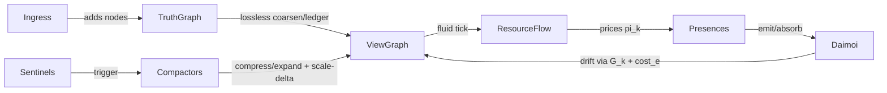
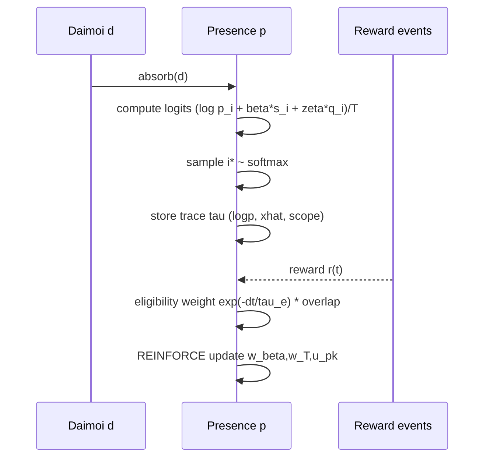

# A Self-Organizing Graph Runtime for Coupled Meaning and Resource Flow

## Executive summary

This system is a **graph-native runtime** in which (i) *documents and system resources* are represented as **nodes and reservoirs** in a persistent **TruthGraph**, (ii) computation is performed on a **losslessly compressible ViewGraph** that is dynamically coarsened and refined, and (iii) behavior emerges from **Presences** (agents with internal state only) exchanging **Daimoi** (probabilistic message packets) and participating in a **fluid resource economy** with pressure-derived local prices and **need/mass-induced gravity wells** defined over **graph distance**.

The core novelty is the **tight coupling of semantics and systems**: semantic organization is not only metadata but is *embedded into the physical topology* so that **shortest paths, congestion, and local “gravity basins” are directly observable and auditable** (computed using standard shortest-path methods citeturn1search0). Resource allocation is framed as a decentralized **prices-from-scarcity** mechanism analogous to network utility / congestion-control formulations using shadow prices citeturn0search2turn1search14, while **Daimoi interpretation** uses **stochastic sampling** withPresence-specific lens/needs bias and **online policy-gradient learning** (REINFORCE-style) citeturn0search0turn0search1.

Lossless compression of ViewGraph is positioned as **quotient/coarsening with full reconstruction ledgers**, consistent with known classes of **lossless graph summarization** (including quotient-based structural summaries) citeturn2search11turn3search2 and with practical **large-graph compression** techniques (e.g., adjacency-list redundancy exploitation) citeturn0search3turn5search1.

The report below formalizes the abstractions, derives algorithms, specifies a hybrid (fluid + particle) simulator, and proposes a publishable evaluation methodology.

## Formal model and core abstractions

### Notation and state

Let time be discrete (ticks) or continuous with step Δt. Let resource types be
\[
\mathcal{K}=\{\text{CPU}_i,\text{GPU}_j,\text{NPU},\text{RAM},\text{DISK}_\ell,\text{NETUP},\text{NETDOWN}\}.
\]

Let **TruthGraph** be \(G^T=(V^T,E^T)\) and **ViewGraph** be \(G^V=(V^V,E^V)\).

Let Presences be \(\mathcal{P}\) and Daimoi particles be \(\mathcal{D}\).

The world state can be modeled as:
\[
\mathcal{S}(t)=\big(G^T,\,G^V,\,\{X_n(t)\}_{n\in V^V},\,\{X_e(t)\}_{e\in E^V},\,\{S_p(t)\}_{p\in\mathcal{P}},\,\mathcal{D}(t)\big).
\]

### Core symbols (minimal)

| Symbol | Meaning |
|---|---|
| \(n,m\) | nodes in \(V^V\) (Nexus nodes in the runtime graph) |
| \(e=(n\!\to\!m)\) | directed edge in \(E^V\) |
| \(k\) | resource type in \(\mathcal{K}\) |
| \(R[n,k]\) | amount of resource fluid stored at node \(n\) |
| \(Cap[n,k]\) | carrying capacity at node \(n\) |
| \(P[n,k]\) | pressure at node \(n\) for resource \(k\) |
| \(F[e,k]\) | flow along edge \(e\) for resource \(k\) |
| \(F_{\max}[e,k]\) | edge throughput capacity |
| \(sat_e\) | congestion/saturation on edge \(e\) |
| \(a_e\) | semantic affinity of edge \(e\) (0..1) |
| \(cost_e\) | graph-distance traversal cost for edge \(e\) |
| \(L_p\) | purpose/description embedding for Presence \(p\) |
| \(M_p\) | Presence mask (where \(p\) exists) |
| \(need_{p,k}\) | current need intensity of Presence \(p\) for resource \(k\) |
| \(Mass_p\) | Presence mass (weighted by influence over nearby graph) |
| \(\Phi_p(n)\) | gravitational potential projected by \(p\) at node \(n\) |
| \(G_k[n]\) | aggregate gravity map at node \(n\) for resource \(k\) |
| \(\pi_k(n)\) | local unit price for resource \(k\) at location \(n\) |
| \(C\) | scalar CostCredits for a multi-resource spend |
| \(d\) | a Daimoi packet |

### TruthGraph and ViewGraph

**TruthGraph** \(G^T\) is the lossless store: every content object (file/log/message) is a node with immutable provenance edges.

**ViewGraph** \(G^V\) is a **lossless compressed projection** of TruthGraph built by coarsening/quotienting plus a reconstruction ledger:
- A surjective map \(\Pi:V^T\to V^V\) assigns each truth node to exactly one view node (atomic or bundle).
- Each bundle \(b\in V^V\) stores a ledger:
  - membership: \(\Pi^{-1}(b)\),
  - internal edges among those truth nodes,
  - boundary adjacency (edges crossing bundle boundary),
  - sufficient metadata to reconstruct the induced subgraph exactly.

This matches known families of lossless summarization where reconstruction is possible by retaining equivalence-class structure + sufficient edge detail (e.g., quotient summaries/bisimulation families under chosen features) citeturn3search2turn2search11.

Graph compression is also a practical storage concern (independent of the quotient mapping). Techniques like those in WebGraph exploit redundancy in adjacency lists to store massive graphs compactly citeturn0search3, and surveys catalog many lossless representations applicable to the ledger encoding layer citeturn5search1.

### Nexus node (runtime node)

A **Nexus** in the runtime corresponds to a node \(n\in V^V\) with:
- semantic attributes: embedding \(\mathbf{e}_n\), type tags, provenance pointers (into \(G^T\)),
- fluid reservoirs per resource:
  - \(R[n,k]\ge 0\), \(Cap[n,k]>0\),
  - pressure:
    \[
    P[n,k]=P_{\max}[k]\cdot \phi\!\left(\frac{R[n,k]}{Cap[n,k]}\right),
    \quad \phi(x)=\min(1,x)^{\beta},\ \beta\approx 2.5.
    \]
- optional valve parameters for incident edges (conductances).

### Edge state and graph distance cost

Each edge \(e=(n\to m)\) stores:
- throughput capacities \(F_{\max}[e,k]\),
- current flows \(F[e,k]\),
- congestion \(sat_e\in[0,1]\) (e.g., max or weighted average across \(k\)),
- semantic affinity \(a_e\in[0,1]\),
- health/upkeep \(H_e\in[0,1]\) (decays if unused; can be maintained by sponsored flow).

Define traversal cost for **graph distance**:
\[
cost_e = w_L + w_C\cdot sat_e + w_S\cdot (1-a_e).
\]
This yields auditable shortest paths using standard SSSP algorithms citeturn1search0.

### Presence

A **Presence** \(p\in\mathcal{P}\) is the only system actor. It owns internal state only:
\[
S_p=\big(L_p,\ M_p,\ \text{wallet}_p,\ \theta_p,\ \text{traces}_p,\ \text{rates}_p\big).
\]

**Mask.** Let \(M_p\) be a sparse distribution over view nodes (and optionally fields), represented as tuples \((n_i,w_i)\) with \(\sum_i w_i=1\). Mask-weighted expectation of any node function \(g\):
\[
\langle g\rangle_{M_p}=\sum_i w_i\,g(n_i).
\]

**Influence.** Define influence weight \(infl(p,n)\in[0,1]\) (e.g., derived from mask weights + explicit “pins”). This is used for mass and source selection.

**Need.** For each resource \(k\), compute utilization EMA \(u_{p,k}\in[0,1]\). Convert to need:
\[
need_{p,k} = priority_p \cdot \sigma\!\left(a_k(u_{p,k}-\theta_k)\right),
\]
with \(\sigma\) logistic, \(\theta_k\) “care threshold,” \(a_k\) steepness.

**Mass.** Let node mass \(m(n)\) combine information weight and stored-resource weight. Then:
\[
Mass_p=m_0+\sum_{n\in V^V} infl(p,n)\,m(n).
\]

### Daimoi

A **Daimoi** packet \(d\in\mathcal{D}\) is a probability distribution over components:
\[
d=\big(\{c_i\}_{i=1}^M,\ \mathbf{p}\in\Delta^{M-1},\ E,\ A,\ f,\ \text{origin},\ \text{maskSnap}\big).
\]

Each component \(c_i\) includes:
- type \(\tau_i\),
- embedding \(\mathbf{e}_i\),
- payload schema pointer,
- size estimate \(size_i\),
- resource signature \(req(c_i,k)\in[0,1]\) (how related the component is to resource \(k\)).

Energy is an expected message-size budget:
\[
E=\sum_i p_i\,E_{base}(size_i),\quad E_{base}(s)=\alpha s^\gamma.
\]

Amplitude/frequency represent consolidation of repeated emissions (e.g., sublinear scaling with count) and are bookkeeping for “how often” the event occurred.

### Gravity: potentials and maps

Let \(dist(p,n)\) be shortest-path distance from Presence sources to node \(n\) under \(cost_e\). Compute potential:
\[
\Phi_p(n)=G\cdot \frac{Mass_p}{dist(p,n)^2+\epsilon}.
\]

Aggregate per-resource gravity map:
\[
G_k[n]=\sum_{p\in\mathcal{P}_{active(k)}} need_{p,k}\,\Phi_p(n),
\]
computed over bounded radius (see algorithms).

### Pricing and CostCredits

Local unit price per resource (scarcity + congestion):
\[
\pi_k(n)=\exp(\kappa_k\hat P[n,k])\cdot (1+\rho_k\,sat(n)),
\quad \hat P[n,k]=\mathrm{clamp}(P[n,k]/P_{\max}[k],0,1).
\]

Presence-local effective price is mask-weighted with a small learned adapter \(m_{p,k}=\exp(u_{p,k})\):
\[
\pi^{eff}_{p,k}=\langle \pi_k\rangle_{M_p}\cdot m_{p,k},\quad u_{p,k}\in[-u_{\max},u_{\max}].
\]

Normalize a spend Δ by local availability \(Avail_{p,k}=\langle Cap[\cdot,k]\rangle_{M_p}\):
\[
\delta_k=\mathrm{clamp}\Big(\frac{\Delta_k}{\max(Avail_{p,k},\epsilon)},0,\delta_{\max}\Big).
\]

Scalar CostCredits:
\[
C(\Delta;p)=\sum_k \pi^{eff}_{p,k}\,\delta_k.
\]

This parallels the use of prices as Lagrange multipliers/shadow prices in decentralized resource allocation/congestion control citeturn0search2turn1search14.

### Minimal μ-style contracts

```lisp
(nexus.v0
  (fields (embedding e_n) (provenance ptrs))
  (reservoir (R[n,k]) (Cap[n,k]) (pressure P[n,k]))
  (ports (edges incident) (valves cond[e,k])))

(viewgraph.v0
  (nodes V^V) (edges E^V)
  (projection Pi: V^T -> V^V)
  (bundle-ledger (members internal-edges boundary-edges codec))
  (ops (compress region) (expand bundle) (replay lossless)))

(presence.v0
  (purpose-embedding L_p)
  (mask M_p) (influence infl(p,n))
  (need need[p,k]) (mass Mass_p)
  (wallet budgets)
  (learning params traces baselines normalizers))

(daimoi.v0
  (components c_i) (probs p_i sum=1)
  (energy E) (amp A) (freq f)
  (origin presence_id) (mask_snapshot)
  (ops (merge) (drift) (absorb -> sample)))
```

## Algorithms for Daimoi, routing drift, and online learning

### Daimoi creation and consolidation

**Creation (Presence-only emission).** On an internal event, Presence \(p\) creates components \(\{c_i\}\) (often \(M=1\)). Initialize distribution using its purpose embedding (lens seed):
\[
p_i^{emit}=\mathrm{softmax}(\gamma\,sim(L_p,\mathbf{e}_i)+b_i).
\]
Compute energy \(E\) and set \(A,f\) from deduplication windows.

**Mixing/merging (consolidation).** When two packets \(d_1,d_2\) consolidate:
\[
\mathbf{p}=\frac{E_1\mathbf{p}_1+E_2\mathbf{p}_2}{E_1+E_2},\quad E=E_1+E_2,
\]
with \(A,f\) combined (sublinear recommended) to avoid blowup.

### Daimoi drift across the graph (particle routing)

Define Daimoi resource signature:
\[
\rho_{d,k}=\sum_i p_i\,req(c_i,k).
\]

For neighbor step \(n\to m\), define drift score:
\[
Drift_d(n\!\to\!m)=
\eta\sum_k \rho_{d,k}(G_k[m]-G_k[n]) - \upsilon\,cost_{n\to m}.
\]

Route stochastically:
\[
Pr(n\!\to\!m)\propto \exp(Drift_d(n\!\to\!m)).
\]

This yields visible, auditable “rivers” because both \(G_k\) and \(cost_e\) are graph-local and inspectable.

### Biased sampling on absorption (lens + need)

When Presence \(p\) absorbs Daimoi \(d\), compute per-component lens similarity:
\[
s_i=sim(L_p,\mathbf{e}_i).
\]
Compute need match:
\[
q_i=\sum_k need_{p,k}\,req(c_i,k).
\]

Let features \(x\) summarize local context (pressure, congestion, wallet, message entropy, etc.). Map to parameters:
\[
\beta(x)=\mathrm{clip}(\mathrm{softplus}(w_\beta^\top \hat x),0,\beta_{\max}),
\]
\[
T(x)=\mathrm{clip}(T_{\min}+\mathrm{softplus}(w_T^\top \hat x),T_{\min},T_{\max}).
\]

Define logits:
\[
\ell_i = \log p_i + \beta(x)s_i + \zeta q_i - \lambda\,cost_i,
\]
and absorption distribution:
\[
\tilde p_i=\mathrm{softmax}\left(\frac{\ell_i}{T(x)}\right).
\]

Then sample \(i^\*\sim\mathrm{Categorical}(\tilde{\mathbf{p}})\). This is the “each Presence interprets each packet through its own lens” rule.

**Implementation note.** Sampling from categorical can be done stably via the Gumbel-Max trick (sample Gumbels, add to logits, take argmax). Surveys and reparameterization work discuss this family of methods citeturn2search2turn2search26.

### Trace recording and probabilistic credit assignment

On absorption at time \(t\), store a trace \(\tau\):
- \(\tau.time=t\)
- \(\tau.\logp=\log\tilde p_{i^\*}\)
- \(\tau.\hat x\) (normalized feature snapshot)
- \(\tau.scope\) (mask snapshot / node region ids)
- optionally: \(\tau.grad\) cache or sufficient statistics

When outcome events occur (Use/Regret/Cost), compute reward \(r(t)\) over a window:
\[
r = w_U\Delta U - w_R\Delta R - w_C\,C(\Delta;p).
\]

Assign event credit by eligibility and scope overlap (credit assignment itself is probabilistic):
\[
w_\tau \propto \exp\left(-\frac{t-\tau.time}{\tau_e}\right)\cdot overlap(\tau.scope, event.scope).
\]
Distribute reward to traces (normalize weights).

Eligibility traces are a standard mechanism to attribute delayed outcomes to earlier decisions in RL systems citeturn0search1.

### Online learning updates (REINFORCE + baselines)

Treat absorption as a stochastic policy. Update parameters \(\theta=\{w_\beta,w_T,u_{p,k}\}\) using REINFORCE-style gradient estimates citeturn0search0turn0search1:
\[
\theta \leftarrow \theta + \eta \cdot \delta \cdot \nabla_\theta \log \tilde p_{i^\*},
\quad \delta=\frac{(\hat r_\tau-\bar r)}{\sigma_r+\epsilon}.
\]
Maintain baseline \(\bar r\) and scale \(\sigma_r\) as EMAs.

Bandit/RL texts provide stability guidance for stochastic policies, exploration schedules, and baselines citeturn2search0turn0search1.

### Reproducible pseudocode

```python
def absorb_and_learn(presence, daimoi, now):
    x = features(presence, daimoi)          # includes pressures, sat, wallet, entropy
    xhat = normalize_ema(presence.norm, x)

    beta = clip(softplus(dot(presence.w_beta, xhat)), 0, BETA_MAX)
    temp = clip(T_MIN + softplus(dot(presence.w_T, xhat)), T_MIN, T_MAX)

    logits = []
    for comp in daimoi.components:
        s = cosine(presence.L, comp.embedding)
        q = sum(presence.need[k] * comp.req[k] for k in K)
        cost_i = comp_size_cost(comp)       # optional
        logits.append((math.log(comp.p) + beta*s + ZETA*q - LAMBDA*cost_i) / temp)

    i_star = categorical_sample_softmax(logits)  # can use Gumbel-Max
    presence.traces.append(Trace(now, i_star, log_softmax(logits)[i_star], xhat, scope=presence.scope))

def apply_reward(presence, reward, now):
    presence.r_bar = ema(presence.r_bar, reward)
    presence.r_var = ema(presence.r_var, (reward - presence.r_bar)**2)
    sigma = math.sqrt(presence.r_var + 1e-9)

    for tau in presence.traces.recent():
        elig = math.exp(-(now - tau.time) / TAU_E)
        rhat = reward * elig
        delta = (rhat - presence.r_bar) / (sigma + 1e-9)
        grad = tau.grad_logp_wrt_params()   # compute from saved logits/xhat
        presence.params += LR * delta * grad

    presence.traces.gc(max_age=TRACE_TTL, max_len=TRACE_MAX)
```

## Hybrid simulation, routing with gravity gradients, and compaction governance

### Fluid vs particle hybrid

- **Fluid layer** (high-volume, continuous): all resource types \(k\) are simulated as conserved flows on \(G^V\). This aligns with “prices from congestion” and distributed optimization views of network control citeturn0search2turn1search14.
- **Particle layer** (low-volume, discrete): Daimoi are discrete packets for control/coordination/audit receipts. They can be consolidated into fewer packets.

This hybrid mirrors practice in large-scale network reasoning: macroscopic flow models for capacity behavior, with discrete signaling for control and accounting.

### Fluid update and valve routing

A simple physically interpretable update:

1. **Compute unconstrained edge flow**:
\[
\tilde F[e,k] = cond[e,k]\cdot (P[n,k]-P[m,k]).
\]

2. **Clamp to capacity**:
\[
F[e,k]=\mathrm{clip}(\tilde F[e,k], -F_{\max}[e,k], F_{\max}[e,k]).
\]

3. **Update reservoirs**:
\[
R[n,k]\leftarrow R[n,k] - \Delta t\sum_{e\in out(n)} F[e,k] + \Delta t\sum_{e\in in(n)} F[e,k] + \text{emit}[n,k]-\text{consume}[n,k].
\]

4. **Recompute pressures**.

**Valve scoring with gravity.** Instead of fixed \(cond[e,k]\), derive it from a softmax over neighbor edges:
\[
score(e,k)=\alpha_P(P[n,k]-P[m,k])+\alpha_G(G_k[m]-G_k[n])+\alpha_A a_e-\alpha_S sat_e-\alpha_H(1-H_e),
\]
\[
cond[e,k]\propto \mathrm{softmax}_e(score(e,k)).
\]

This is a concrete, auditable routing rule: every term is measurable.

### Bounded-radius gravity map computation

To avoid all-pairs costs, compute gravity maps locally:

1. Select sources for Presence \(p\): \(Sources(p)=\) top-\(K\) nodes by \(infl(p,n)\).
2. For each source, run shortest-path search on \(cost_e\) (SSSP) out to radius \(R\) (hops or total cost). Shortest-path methods originate from classic SSSP formulations citeturn1search0.
3. Compute \(\Phi_p(n)\) inside the radius.
4. Accumulate into \(G_k[n]\) for resources where \(need_{p,k}>\text{need}_{min}\).

```python
def update_gravity_maps(presences, Gk_maps):
    clear(Gk_maps)
    for p in presences:
        mass = compute_mass(p)
        needs = compute_need(p)

        sources = topK_sources(p, K_SOURCES)
        dist = multi_source_dijkstra(sources, edge_cost, radius=R_COST)

        for n, d in dist.items():
            phi = G_CONST * mass / (d*d + EPS)
            for k in K:
                if needs[k] > NEED_MIN:
                    Gk_maps[k][n] += needs[k] * phi
```

### Compaction/expansion governance (Sentinel + Compactor)

Use a two-role mechanism:

- **Sentinel** computes *when* to compress or expand: monitors
  - local query/demand intensity,
  - congestion/pressure,
  - “bundle ledger growth,”
  - oscillation/thrash rates.
- **Compactor** executes *how*: performs graph coarsening/uncoarsening and emits “scale-delta” Daimoi to notify Presences that hidden detail became available.

This aligns with known multilevel coarsening ideas in graph algorithms (reduce graph size, operate, then uncoarsen) citeturn1search3, while ensuring losslessness via stored ledgers (consistent with lossless summarization classes) citeturn2search11turn3search2. For storage efficiency of the internal ledger graph, lossless graph compression techniques (e.g., adjacency redundancy exploitation) are directly applicable citeturn0search3turn5search1.

A biologically inspired viewpoint is that edges/paths strengthen with use and decay otherwise—paralleling adaptive transport network models (e.g., Physarum-inspired flux–conductance adaptation) citeturn6search11turn1search1.

## Experimental evaluation plan and diagnostics

### Research questions and metrics

**Efficiency and stability**
- Utilization: mean/percentile resource utilization per \(k\).
- Congestion: mean/percentile \(sat_e\), queue/backlog proxies.
- Latency-to-satisfy: time from “need emitted” to “need satisfied”.
- Oscillation/thrash: compress↔expand flips per region; variance of \(G_k\) and pressures (stability proxy).
- Fairness: Jain’s index over Presences’ achieved allocations (optional; standard in network allocation studies citeturn0search2).

**Semantic/graph quality**
- Retrieval effectiveness: recall@k / hit@k on synthetic query sets.
- Structural coherence: modularity or conductance of topical clusters (if applicable).
- Auditability: explanation cost (size of subgraph needed to justify a routing/absorption decision), and reproducibility (same seeds → same macropatterns).

**Compression**
- ViewGraph compression ratio: \(|V^V|/|V^T|\), \(|E^V|/|E^T|\).
- Expand time: time to materialize a bundle under load.
- Ledger overhead: storage bytes per collapsed truth edge.

### Synthetic workloads

1. **Ingestion-heavy**: continuous stream of documents into random topics; periodic bursts.
2. **Query-heavy**: Muse-like presences generate localized query demand; hot spots move over time.
3. **Adversarial congestion**: induce edge bottlenecks and see whether prices + gravity re-route.
4. **Multi-tenant competition**: several Presences with conflicting needs/priority; measure fairness/stability.
5. **Compression stress**: many cold regions + a few hot; verify lossless expand correctness.

### Ablations

| Ablation | Change | Expected effect |
|---|---|---|
| No gravity | set \(G_k\equiv 0\) | less targeted flow; more pressure-driven diffusion; weaker congregation basins |
| No learned lens | fixed \(\beta,T\) | reduced personalization/role specialization; slower adaptation under shifting mix |
| Deterministic collapse | MAP instead of sampling | less diversity; potentially more stable but more brittle under ambiguity |
| Fixed prices | constant \(\pi_k\) | poorer congestion response; higher saturation variance |
| No compaction | keep \(G^V=G^T\) | correctness unchanged; scalability and audit views degrade |
| No edge upkeep | remove \(H_e\) decay | hub formation risk; topology densifies |

### Visualization and diagnostics

Requested figures (paper-ready):
- **Architecture diagram**: TruthGraph ↔ ViewGraph, fluid layer, particle layer, Presences, Sentinel/Compactor loop.
- **Heatmaps on the graph**:
  - \(P[n,k]\) pressure,
  - \(G_k[n]\) gravity potential,
  - edge saturation \(sat_e\),
  - bundle boundaries.
- **Time-series dashboards**: utilization, congestion, reward, β/T trajectories, compression ratio.
- **Audit trails**: for a chosen decision, show shortest-path tree, edge costs, and gravity gradient contributions.

Mermaid figure requests (ready to paste into a paper appendix):





## Implementation blueprint, scalability, and initial priors

### Data schemas (language-agnostic)

**Node (Nexus)**
- `node_id`
- `kind`: atomic|bundle
- `embedding_ref`
- `truth_ptrs`: provenance pointers into \(G^T\)
- `R[k]`, `Cap[k]`, `P[k]`
- `bundle_ledger_ref` (if bundle)

**Edge**
- `src_id`, `dst_id`
- `a_e` semantic affinity
- `H_e` health
- `Fmax[k]`
- `F[k]`
- `sat_e` (cached)
- `last_used_ts`, `sponsor_id` (optional)

**Bundle ledger**
- `bundle_id`
- `members` (truth node ids or ranges)
- `internal_edges` (compressed)
- `boundary_edges` (compressed)
- `codec` parameters (pluggable; WebGraph-like adjacency compression is a candidate citeturn0search3)

**Presence**
- `presence_id`, `kind`
- `L_p` embedding
- `mask` (sparse list of (node_id, weight))
- `priority`
- `util_ema[k]`, `need[k]`
- `wallet[k]`
- learning:
  - `w_beta`, `w_T`
  - `u_pk` adapters
  - normalizer stats (μ,σ per feature)
  - baseline stats (r̄,var)
  - trace ring buffer

**Daimoi**
- `daimoi_id`, `origin_presence_id`
- `components[]`: (type, embedding_ref, req[k], size_est, payload_ref)
- `p[]` probabilities
- `E`, `A`, `f`
- `mask_snapshot_ref`
- `ttl`, `hop_count`, `route_meta`

### Update triggers and scheduling

- Fluid tick: fixed-rate (e.g., 10–60 Hz sim time) or event-driven per congested region.
- Gravity maps: recompute on triggers:
  - \(\Delta need>0.05\),
  - mass change >10%,
  - significant congestion delta on edges in radius,
  - compaction topology change.
- Learning updates: apply at a capped frequency per Presence (cooldown) to prevent instability.

### Complexity notes

Let \(N=|V^V|\), \(E=|E^V|\), \(K=|\mathcal{K}|\).

- Fluid tick: \(O(EK)\) for direct edge updates.
- Gravity maps: for each active Presence, bounded Dijkstra within radius \(r\) nodes/edges:
  - \(O(r\log r)\) typical per update, with small constants due to radius.
- Daimoi drift: per hop \(O(\deg(n)\cdot K)\) to score neighbors (often small degree due to upkeep caps).
- Absorb sampling: \(O(M)\) components per Daimoi; \(M\) is usually small due to consolidation.

### Initial priors and safety caps

Recommended starting hyperparameters (conservative, stable):

**Edge cost weights**
- \(w_L=1,\ w_C=2,\ w_S=1\).

**Gravity**
- radius \(R_{cost}=6\) (or hop radius 3),
- \(NEED_{min}=0.05\),
- cap \(\Phi_p(n)\le \Phi_{max}\).

**Price sensitivity**
- \(\kappa_k\): CPU 1.4, GPU 1.6, NPU 1.5, RAM 0.8, DISK 1.1, NET 1.2 (scarcity sensitivity),
- \(\rho_k\): compute 0.2, RAM 0.1, DISK 0.4, NET 0.5 (congestion premium),
- adapter bounds: \(u_{\max}=0.5\) (≈×1.65).

These follow the intended behavior “NET/DISK spike first under congestion; GPU spikes under scarcity,” while leaving room for learning.

**Lens learning**
- \(\beta_{\max}=6\),
- \(T_{min}=0.2,\ T_{max}=2.0\),
- learning rate \(\eta\) small (e.g., 1e-3–1e-2 for linear heads),
- trace TTL 30–120s; trace max length capped.

**Eligibility**
- \(\tau_e\) 5–20s (task dependent),
- baseline EMA decay 0.01–0.05.

### Design alternatives table (paper-ready)

| Design choice | Option A | Option B | Trade-off summary |
|---|---|---|---|
| Daimoi collapse | **Sampling** | MAP/argmax | Sampling supports diversity + exploration; MAP improves determinism/audit repeatability. RL texts emphasize stochastic policies for exploration citeturn0search1turn2search0. |
| Gravity distance | **Graph distance** | Embedding distance | Graph distance is auditable and reflects “semantics-as-topology”; embedding distance can be more semantic but less interpretable. Shortest-path is standard and efficient citeturn1search0. |
| Gravity compute | **Bounded radius** | Global potentials | Bounded radius scales; global is expensive and can create nonlocal artifacts. |
| Energy aggregation | Expected \(E=\sum p_iE_i\) | Max \(E=\max E_i\) | Expected is smoother; max enforces worst-case budgeting. |
| Consolidation scaling | \(A=\sqrt{n}\) or \(\log(1+n)\) | \(A=n\) | Sublinear avoids giant packets while preserving “repeat count” semantics. |
| ViewGraph compression | Quotient + ledger | Lossy summarization | Lossless supports provenance/audit; lossy can improve scale but breaks reconstruction guarantees (surveys separate these classes) citeturn2search11turn3search2. |

### Source prioritization map (for related work section)

- **Flow / transport networks & decentralized pricing**: shadow prices and utility maximization in networks citeturn0search2turn1search14; broader NUM framing references these as benchmarks citeturn3search0.
- **Stochastic policies / softmax sampling**: softmax action selection and exploration in RL citeturn2search5turn0search1; bandit frameworks for online decision-making citeturn2search0.
- **Policy gradient learning**: REINFORCE estimator citeturn0search0.
- **Graph compression & lossless representations**: WebGraph compression techniques citeturn0search3; modern surveys on lossless graph compression and space-efficient representations citeturn5search1.
- **Lossless graph summarization / quotients**: survey of methods including lossless categories citeturn2search11; structural quotient summaries/bisimulation survey citeturn3search2.
- **Self-organizing transport analogs**: Physarum-inspired adaptive network models (flux strengthens edges; unused decays) citeturn6search11turn1search1.

### Experiment timeline

| Phase | Duration | Deliverables |
|---|---:|---|
| Instrumentation | 1–2 weeks | logging for \(P,G_k,\pi\), traces, bundle ledgers; replayable seeds |
| Baseline workloads | 1 week | ingestion/query/congestion scenarios; stable metrics |
| Ablations | 1–2 weeks | no-gravity, fixed-lens, fixed-price, MAP collapse, no-compaction comparisons |
| Scaling study | 1–2 weeks | \(N,E\) sweep; bounded-radius sensitivity; compression overhead |
| Paper figures | 1 week | architecture diagram, heatmaps, time-series plots, audit-case studies |
| Write-up | 2–3 weeks | formal model + algorithms + results; appendix with pseudocode/mermaid |

