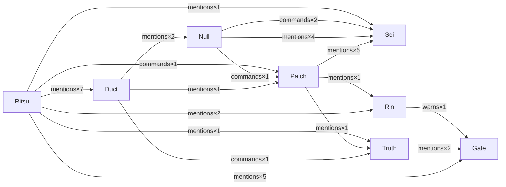

# Gates of Truth — Relationships (Local Box)

```mermaid
graph LR
  Ritsu["Ritsu"] -->|"mentions×7"| Duct["Duct"]
  Patch["Patch"] -->|"mentions×5"| Sei["Sei"]
  Ritsu["Ritsu"] -->|"mentions×5"| Gate["Gate"]
  Null["Null"] -->|"mentions×4"| Sei["Sei"]
  Duct["Duct"] -->|"mentions×2"| Null["Null"]
  Ritsu["Ritsu"] -->|"mentions×2"| Rin["Rin"]
  Null["Null"] -->|"commands×2"| Sei["Sei"]
  Truth["Truth"] -->|"mentions×2"| Gate["Gate"]
  Duct["Duct"] -->|"mentions×1"| Patch["Patch"]
  Ritsu["Ritsu"] -->|"mentions×1"| Sei["Sei"]
  Null["Null"] -->|"commands×1"| Patch["Patch"]
  Patch["Patch"] -->|"mentions×1"| Rin["Rin"]
  Duct["Duct"] -->|"commands×1"| Truth["Truth"]
  Patch["Patch"] -->|"mentions×1"| Truth["Truth"]
  Ritsu["Ritsu"] -->|"commands×1"| Patch["Patch"]
  Ritsu["Ritsu"] -->|"mentions×1"| Truth["Truth"]
  Rin["Rin"] -->|"warns×1"| Gate["Gate"]
```
